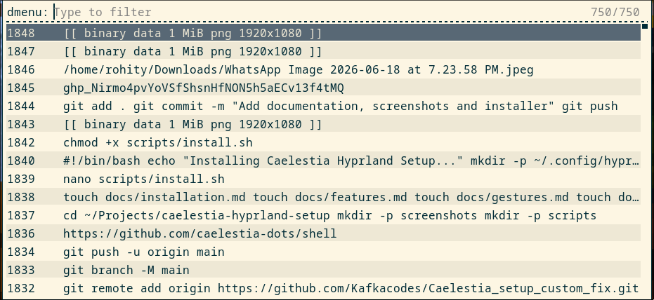
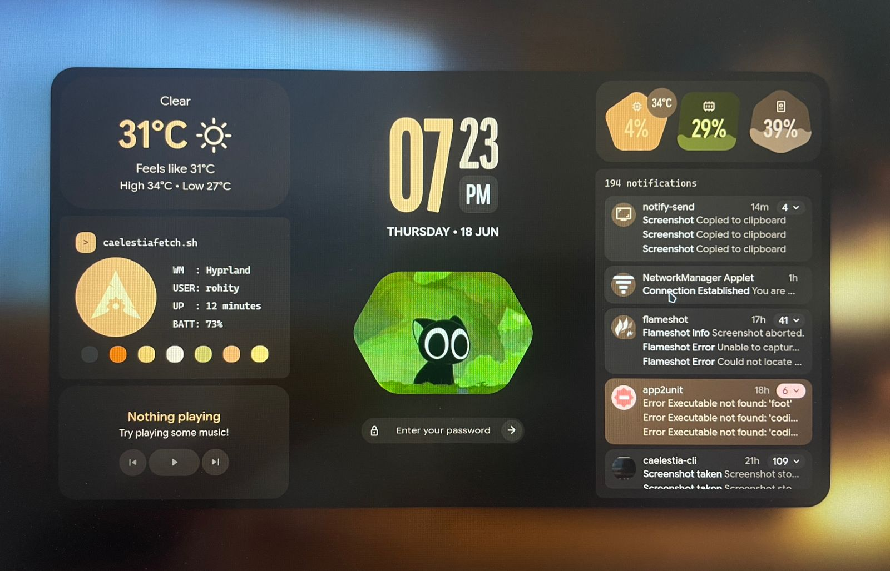
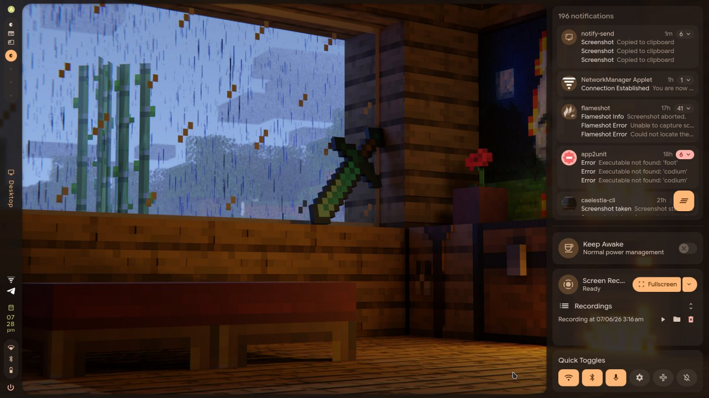

# Caelestia Setup Custom Workflow

A customized Arch Linux + Hyprland + Caelestia setup featuring custom workflows, gesture support, clipboard integration, troubleshooting fixes, and quality-of-life improvements.

caelestia dot files from :- https://github.com/caelestia-dots/shell.

# *THIS IS JUST MY OWN CONFIGURATION FOR WORKFLOW NOT THE WHOLE CAELESTIA SETUP*


## Features

* Hyprland + Caelestia setup
* Magic Workspace (Scratchpad)
* 3-Finger Touchpad Gestures
* Rofi Clipboard Manager
* Fish Shell
* Foot Terminal
* Dashboard Customizations
* Screenshot Workflow
* Custom Keybinds
* Troubleshooting Documentation

## Screenshots

### Dashboard

https://github.com/user-attachments/assets/642f21e6-a9c2-445a-b063-22c02fe016ec

### Clipboard Manager



### Login Screen



### Notification Panel



## Quick Start

Clone the repository:

```bash
git clone https://github.com/Kafkacodes/Caelestia_setup_custom_fix.git

cd Caelestia_setup_custom_fix
```

Run the installer:

```bash
chmod +x scripts/install.sh

./scripts/install.sh
```

## Documentation

### Setup

* [Installation Guide](docs/installation.md)
* [Features](docs/features.md)

### Configuration

* [Gestures](docs/gestures.md)
* [Clipboard Manager](docs/clipboard.md)

### Usage

* [Keyboard Shortcuts](docs/shortcuts.md)

### Troubleshooting

* [Troubleshooting Guide](docs/troubleshooting.md)

## Included Configurations

```text
configs/
├── fish/
├── foot/
└── hyprland.lua
```


## License

Feel free to use, modify, and adapt these configurations for your own setup.
